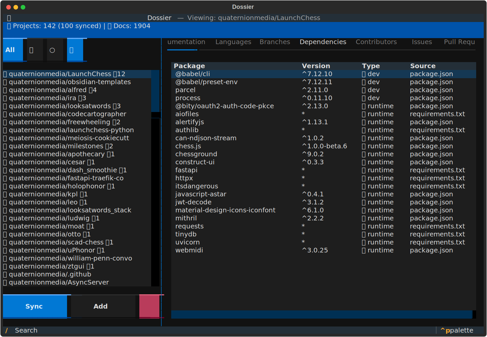

# Dossier

> **Decentralized project tracking for cross-domain teams.** Replace proprietary tools like Jira with a data-modeled, cache-merge architecture that works offline-first and syncs across repos, teams, and organizations.

[](https://www.python.org/downloads/)
[](https://opensource.org/licenses/MIT)
[](https://github.com/quaternionmedia/dossier/actions)

<p align="center">
  
</p>

---

## Why Dossier?

**Tired of context-switching between Jira, GitHub, Notion, and spreadsheets?** Dossier unifies project tracking into a single, data-modeled interface that:

- **Works offline** — Local SQLite cache, sync when connected
- **Scales across domains** — Same fixed layouts whether tracking 1 repo or 100 orgs
- **No vendor lock-in** — Your data, your format, exportable `.dossier` files
- **Keyboard-driven speed** — Consistent TUI layouts you can navigate blindfolded

## ✨ Features

| Feature | Description |
|---------|-------------|
| 🎯 **Cross-Domain Tracking** | Unified view across repos, teams, orgs — no more tab sprawl |
| 📦 **Data-Modeled** | 12 SQLModel schemas: Projects, Issues, PRs, Versions, Branches, Dependencies, Contributors, and more |
| 🔄 **Cache-Merge Architecture** | Offline-first local cache, merge upstream changes on sync |
| 🖥️ **Fixed-Layout TUI** | Consistent 11-tab dashboard — build muscle memory, gain speed |
| 🔗 **Linkable Entities** | Every model element (docs, versions, issues, PRs) is navigable and linkable |
| ⌨️ **Headless-First** | CLI, TUI, and API — no browser required |
| 📤 **Portable Exports** | `.dossier` YAML files for sharing and archival |
| 🐙 **GitHub Native** | Deep integration with repos, users, orgs — but not locked to it |

### Fixed-Layout TUI Tabs

Same 11 tabs, same positions, every project. Build muscle memory:

`Dossier` • `Details` • `Documentation` • `Languages` • `Branches` • `Dependencies` • `Contributors` • `Issues` • `Pull Requests` • `Releases` • `Components`

## 📦 Installation

```bash
# Clone the repository
git clone https://github.com/quaternionmedia/dossier.git
cd dossier

# Install with uv
uv sync
```

## 🚀 Quick Start

### Launch the TUI Dashboard

```bash
uv run dossier dashboard
```

Keyboard shortcuts: `q` quit | `r` refresh | `s` sync | `o` open GitHub | `a` add | `d` delete | `/` search | `f` filter | `?` help

### CLI Usage

```bash
# Add a project
uv run dossier projects add my-project -d "My awesome project"

# Sync from GitHub (recommended)
uv run dossier github sync https://github.com/owner/repo

# Sync all repos from a user or org
uv run dossier github sync-user astral-sh
uv run dossier github sync-org microsoft --limit 10

# List and query projects
uv run dossier projects list -v
uv run dossier query my-project --level summary

# Start the API server
uv run dossier serve --reload
```

## 🔐 GitHub Authentication Setup

GitHub integration works without authentication but is **rate-limited to 60 requests/hour**. For better performance:

### 1. Create a Personal Access Token

1. Go to [GitHub Settings → Developer settings → Personal access tokens → Tokens (classic)](https://github.com/settings/tokens)
2. Click "Generate new token (classic)"
3. Select scopes:
   - `public_repo` - for public repositories
   - `repo` - for private repositories (optional)
4. Copy the generated token (`ghp_...`)

### 2. Set the Environment Variable

```bash
# Linux/macOS (add to ~/.bashrc or ~/.zshrc)
export GITHUB_TOKEN=ghp_xxxxxxxxxxxxxxxxxxxx

# Windows (PowerShell)
$env:GITHUB_TOKEN = "ghp_xxxxxxxxxxxxxxxxxxxx"

# Windows (Command Prompt)
set GITHUB_TOKEN=ghp_xxxxxxxxxxxxxxxxxxxx
```

### 3. Verify Authentication

```bash
# Check rate limit (should show 5000 instead of 60)
uv run dossier github sync-user yourname --limit 1
# Look for: 📊 Rate limit: 4999/5000 remaining
```

| Without Token | With Token |
|---------------|------------|
| 60 requests/hour | 5000 requests/hour |
| Public repos only | Public + private repos |
| May hit rate limits | Reliable batch syncing |

## 📚 Documentation

| Document | Description |
|----------|-------------|
| [Quickstart](docs/quickstart.md) | Get running in 5 minutes |
| [Workflows](docs/workflows.md) | Copy-paste ready examples |
| [Overview](docs/overview.md) | Core concepts |
| [Architecture](docs/architecture.md) | System design |
| [Extending](docs/extending.md) | Customize for your needs |
| [Contributing](docs/contributing.md) | Development guide |

## 📄 Dossier File Format

Export standardized project overviews to `.dossier` files (YAML format):

```bash
# Export a project
uv run dossier export dossier owner/repo

# Show dossier without saving
uv run dossier export show owner/repo

# Export all projects
uv run dossier export all -d ./exports

# Create template .dossier file
uv run dossier init myproject
```

The `.dossier` format includes:
- Project metadata (name, description, repository, stars)
- Tech stack (languages with percentages)
- Dependencies (runtime, dev, by source)
- Activity metrics (issues, PRs, releases, contributors)
- Useful links

## 🗄️ Database Migrations

Manage database schema changes with Alembic:

```bash
# Apply pending migrations
uv run dossier db upgrade

# Show current revision
uv run dossier db current

# Show migration history
uv run dossier db history

# Create new migration
uv run dossier db revision "add new field"

# Rollback one migration
uv run dossier db downgrade
```

## 🛠️ Development

```bash
# Run tests
uv run pytest
uv run dossier dev test          # Via CLI
uv run dossier dev test -c       # With coverage

# Linting
uv run ruff check .
uv run ruff format .

# Dev utilities
uv run dossier dev status        # Show database stats
uv run dossier dev reset -y      # Reset database
uv run dossier dev seed -e       # Create example data
uv run dossier dev purge         # Remove test projects
```

## 🌐 API Reference

Start the API server with `uv run dossier serve --reload`. Access interactive docs at http://localhost:8000/docs

### Endpoints

| Method | Endpoint | Description |
|--------|----------|-------------|
| GET | `/` | API info |
| GET | `/health` | Health check |
| GET | `/projects` | List all projects |
| POST | `/projects` | Create project |
| GET | `/projects/{name}` | Get project |
| GET | `/projects/{name}/components` | List subprojects |
| POST | `/projects/{name}/components` | Add component relationship |
| PUT | `/projects/{name}/components/{child}` | Update relationship |
| DELETE | `/projects/{name}/components/{child}` | Remove relationship |
| GET | `/components` | List all component relationships |
| GET | `/docs/{name}` | Query documentation |
| GET | `/dossier/{name}` | Get project dossier |
| POST | `/github/sync` | Sync GitHub repository |
| GET | `/github/info` | Get GitHub repo info |
| GET | `/github/search` | Search GitHub repos |

## 📁 Project Structure

```
dossier/
├── src/dossier/
│   ├── cli.py              # Click CLI commands
│   ├── api/main.py         # FastAPI application
│   ├── models/schemas.py   # SQLModel data models
│   ├── parsers/
│   │   ├── base.py         # Markdown parser
│   │   └── github.py       # GitHub API client
│   └── tui/app.py          # Textual TUI dashboard
├── tests/                  # pytest test suite
├── docs/                   # Documentation
├── CHANGELOG.md            # Version history
├── CONTRIBUTORS.md         # Project contributors
└── pyproject.toml          # Project configuration
```

## 📜 License

MIT License - see [LICENSE](LICENSE) for details.

---

<p align="center">
  Made with ❤️ by <a href="https://github.com/quaternionmedia">Quaternion Media</a>
</p>
