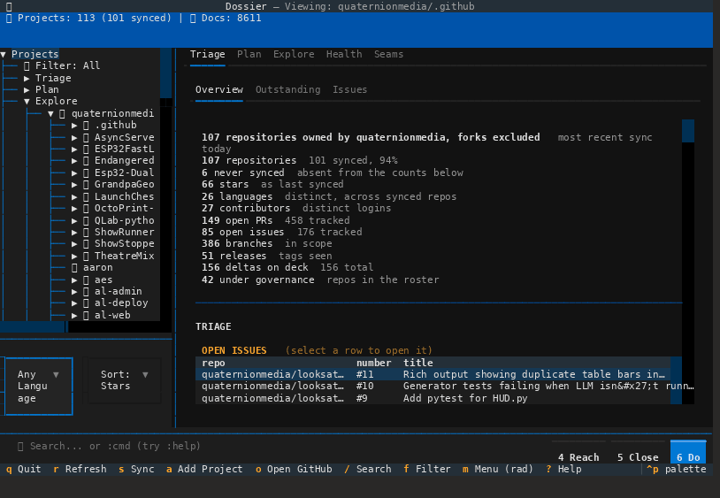
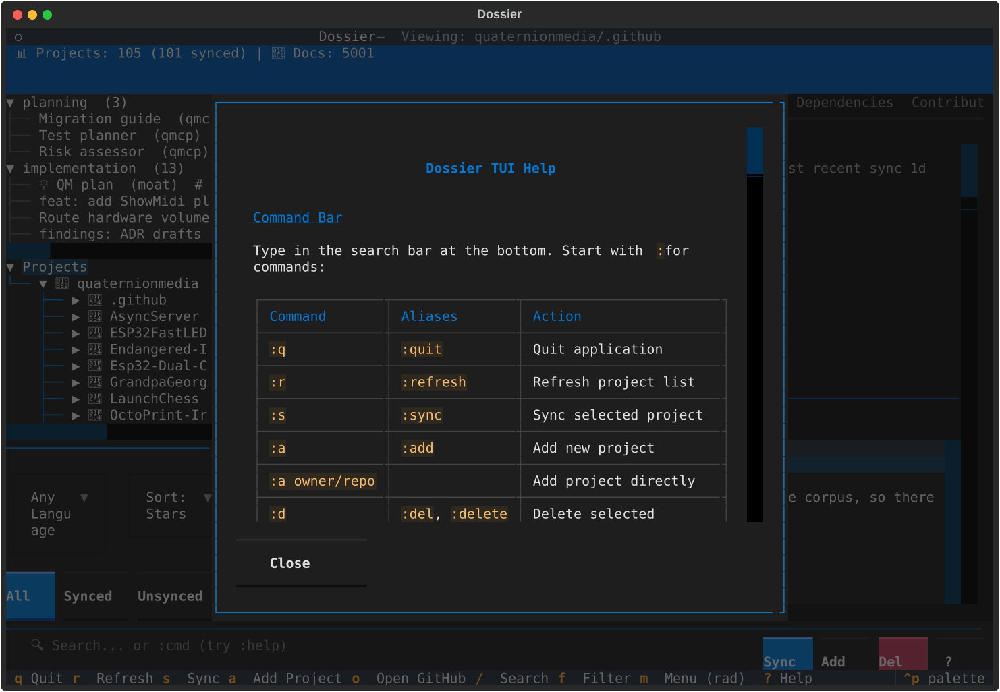
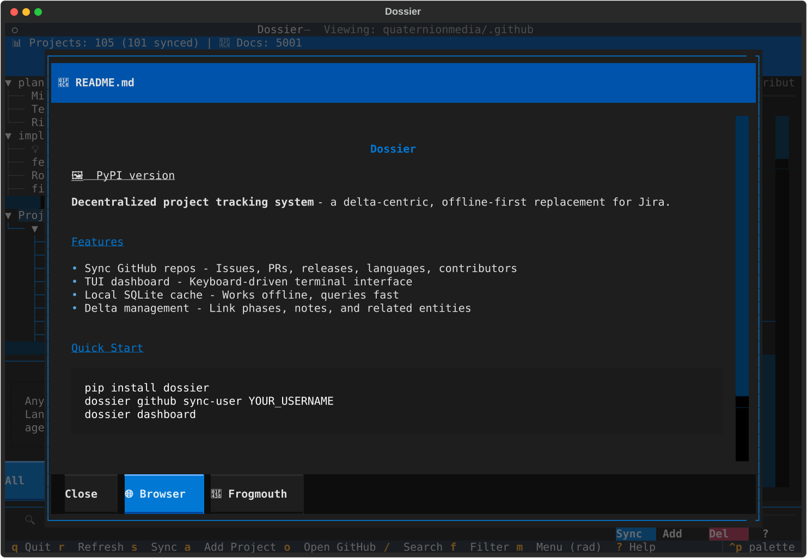
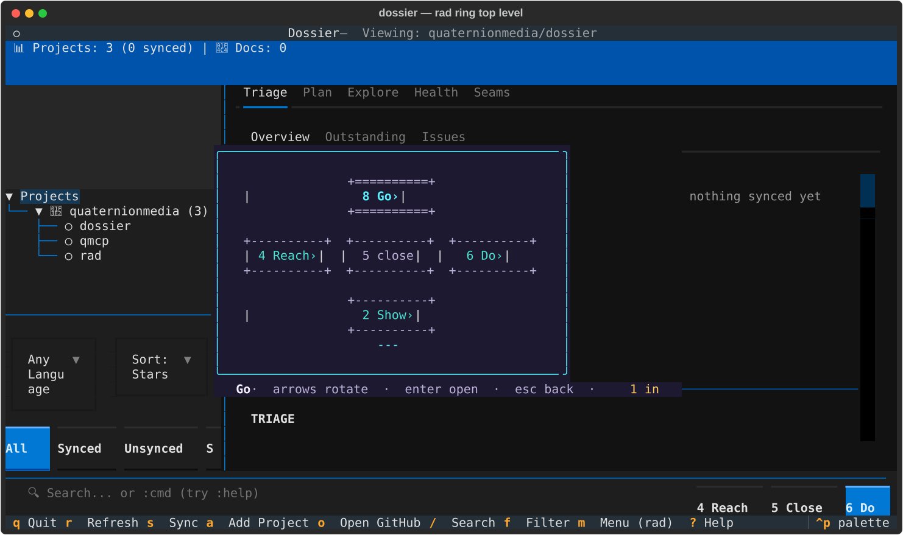
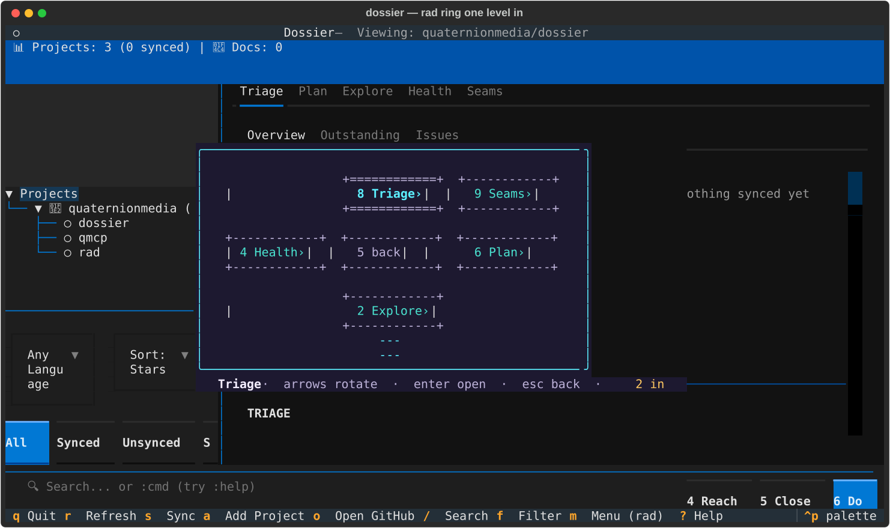
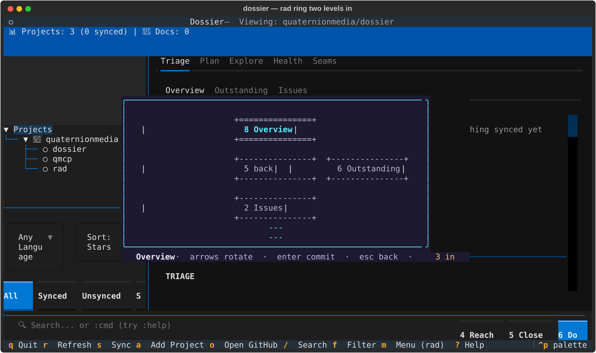

# Dossier

> **Keep track of what every project is doing, without asking anybody.**
> Dossier reads your repositories directly and shows one view of them: what is in
> flight, who is working where, and where two systems disagree about the same thing.
>
> It runs on your machine and keeps its own database, so it works whether or not
> anybody remembered to update a ticket, and whether or not you are online.

[](https://www.python.org/downloads/)
[](https://opensource.org/licenses/MIT)
[](https://github.com/quaternionmedia/dossier/actions)

<p align="center">
  
</p>

<p align="center">
  <em>Three views, four seconds each. Recorded by the test suite from the
  application itself.</em>
</p>
<p align="center">
  
</p>
<p align="center">
  
</p>


## ⚡ TL;DR - Get Running in 60 Seconds

```bash
# Install
git clone https://github.com/quaternionmedia/dossier.git && cd dossier && uv sync

# Set GitHub token (get one at https://github.com/settings/tokens)
export GITHUB_TOKEN=ghp_xxxxxxxxxxxxxxxxxxxx

# Sync your repos and launch
uv run dossier github sync-user YOUR_USERNAME && uv run dossier dashboard
```

**That's it!** Navigate with arrow keys, `Tab` between panels, `s` to sync, `q` to quit.

---

## The workflows

Short, repeatable, composable, and **every one of them stops somewhere for a
person** — because a workflow whose human step is implicit is how somebody ends
up approving nine things having read seven.

```sh
dossier cookbook
dossier cookbook --name 'Start a slice'
```

[The whole cookbook](docs/cookbook.md) — starting a slice, checking what a
branch actually carries, running the gates locally, opening and merging your own
pull request, cutting a tag, sweeping a dependency, retiring a branch. Sketches
are marked as sketches.

## Why Dossier?

**Feeling tired of context-switching between Jira, GitHub, Notion, and spreadsheets?** Dossier unifies project tracking into a single, data-modeled interface that:

- **Works offline** - Local SQLite cache, sync when connected
- **Scales across domains** - Same fixed layouts whether tracking 1 repo or 100 orgs
- **Delta-centric change units** - Track work as deltas with phases, notes, and links
- **No vendor lock-in** - Your data, your format, exportable `.dossier` files
- **Keyboard-driven speed** - Consistent TUI layouts you can navigate blindfolded


## One menu, everywhere: the rad menu

Press **`m`** anywhere in the dashboard. Nine cells open over whatever you were
looking at, laid out like a numeric keypad:

```
7 8 9
4 5 6     5 always backs out
1 2 3
```

**Press the digit.** Any item is one keystroke away, wherever the highlight
happens to be. `7` is up-left on your keyboard and up-left on the screen.

<p align="center">
  
</p>

The four verbs never change — **Go** somewhere, **Do** something, **Show** a
different slice, **Reach** into another system. What sits under them does, so
you learn the menu once instead of learning each screen's menu.

<p align="center">
  
</p>

Under **Go** the views are grouped, because eighteen of them do not fit on nine
cells. The group is a level you press through rather than a heading somebody
invented for a page — which is what keeps the number and the route the same
thing.

<p align="center">
  
</p>

**Or walk there.** Arrow keys move, and so does `wasd` — the same directions
under either hand. Movement always lands on something choosable, never on an
empty cell.

**Diagonals work both ways.** A terminal cannot report two keys held together,
so pressing up then left within a moment is read as the corner, `7`. Press them
slowly and you walk to the same cell one step at a time. Same destination,
nothing depending on how fast you type.

**`5` always backs out** — one level, then closes. It never holds an item, at
any depth, so you never have to look to find out what the middle does.

The dashboard stays visible behind it, because a menu that hides the thing you
are acting on makes you remember what you were looking at.

It counts what it costs you. Every choice records how many keystrokes it took
from opening the menu to committing, so a menu that grows awkward shows up as a
number rather than as a vague feeling. One input to open, then one per level.

**Every command has a number, and the number is the route.** `6.2` is sync:
`6` opens Do, `2` is the third thing under it. So it is `m` `6` `2` from
anywhere. [docs/commands.md](docs/commands.md) is the index — every command,
numbered by the keys that reach it, with the command that does the same thing
outside the application beside it. [docs/rad-commands.md](docs/rad-commands.md)
is the menu sheet, marking which commands are wired and which are in the menu
but not applied yet. Both are generated from the menu itself.

**`m` `6` `2` makes what you are looking at current.** The tab decides what
gets refreshed rather than whatever happens to be selected, anything already
current is left alone, and a large fetch states what it would do and waits for
you to press it again.

Two more are wired: **`m` `4` `6`** puts a conversation export into the archive,
and **`m` `8` `6` `6`** reviews a dependency sweep across every repository that
declares it. The rest of the menu is greyed out and cannot be selected — an
unavailable command keeps its cell, because dropping it would renumber every
command after it. The sheet says which are which; this page deliberately does
not repeat the list.

This is an implementation of [rad](https://github.com/quaternionmedia/rad),
Quaternion Media's interaction contract, in a terminal. The same four verbs are
meant to work the same way in a browser.

**Both screenshots above are produced by the test suite**, by the tests that
assert the menu behaves — so they cannot show something the code stopped doing.
They changed when this layout did, without anybody remembering to retake them.


## ✨ Features

| Feature | Description |
|---------|-------------|
| 🎯 **Cross-Domain Tracking** | Unified view across repos, teams, orgs — no more tab sprawl |
| 📦 **Data-Modeled** | SQLModel schemas: Projects, Issues, PRs, Versions, Branches, Dependencies, Contributors, and more |
| 🔄 **Cache-Merge Architecture** | Offline-first local cache, merge upstream changes on sync |
| 🖥️ **Hierarchical Project Tree** | Auto-organized by org with inline documentation tree |
| 📄 **Content Viewer** | Click docs/issues/PRs to preview inline with prev/next navigation |
| 🔗 **Linkable Entities** | Every model element is navigable: `owner/repo/issue/123`, `lang/python`, `pkg/fastapi` |
| **Delta Management** | Deltas track change units with phases, notes, and links to issues/PRs/docs |
| ⌨️ **Headless-First** | CLI, TUI, and API — no browser required |
| 📤 **Portable Exports** | `.dossier` YAML files for sharing and archival |
| 🐙 **GitHub Native** | Deep integration with repos, users, orgs — but not locked to it |

### Hierarchical Project Browser

Projects auto-organized by org, with docs tree inline. Same tabs, same positions, every project:

Main tabs: `Dossier` | `Projects` | `Deltas`

Projects subtabs: `Details` | `Documentation` | `Languages` | `Branches` | `Dependencies` | `Contributors` | `Issues` | `Pull Requests` | `Releases` | `Components`

## 📦 Installation

```bash
# Clone the repository
git clone https://github.com/quaternionmedia/dossier.git
cd dossier

# Install with uv
uv sync
```

## 🚀 Quick Start

### Launch the TUI Dashboard

```bash
uv run dossier dashboard
```

Keyboard shortcuts: `q` quit | `r` refresh | `s` sync | `o` open GitHub | `a` add | `d` delete | `l` link | `/` search | `f` filter | `?` help | `n`/`p` next/prev doc

### CLI Usage

```bash
# Sync from GitHub (copy-paste these!)
uv run dossier github sync astral-sh/ruff              # Single repo
uv run dossier github sync-user YOUR_USERNAME          # All your repos
uv run dossier github sync-org microsoft --limit 10   # Org repos

# Browse and query
uv run dossier dashboard                               # Interactive TUI
uv run dossier projects list -v                        # List all projects
uv run dossier projects show astral-sh/ruff            # Show details

# Start the API server
uv run dossier serve --reload
```

## 🔐 GitHub Authentication Setup

GitHub integration works without authentication but is **rate-limited to 60 requests/hour**. For better performance:

### 1. Create a Personal Access Token

1. Go to [GitHub Settings → Developer settings → Personal access tokens → Tokens (classic)](https://github.com/settings/tokens)
2. Click "Generate new token (classic)"
3. Select scopes:
   - `public_repo` - for public repositories
   - `repo` - for private repositories (optional)
4. Copy the generated token (`ghp_...`)

### 2. Set the Environment Variable

```bash
# Linux/macOS (add to ~/.bashrc or ~/.zshrc)
export GITHUB_TOKEN=ghp_xxxxxxxxxxxxxxxxxxxx

# Windows (PowerShell)
$env:GITHUB_TOKEN = "ghp_xxxxxxxxxxxxxxxxxxxx"

# Windows (Command Prompt)
set GITHUB_TOKEN=ghp_xxxxxxxxxxxxxxxxxxxx
```

### 3. Verify Authentication

```bash
# Check rate limit (should show 5000 instead of 60)
uv run dossier github sync-user yourname --limit 1
# Look for: 📊 Rate limit: 4999/5000 remaining
```

| Without Token | With Token |
|---------------|------------|
| 60 requests/hour | 5000 requests/hour |
| Public repos only | Public + private repos |
| May hit rate limits | Reliable batch syncing |

## 📚 Documentation

| Document | Description |
|----------|-------------|
| [Quickstart](docs/quickstart.md) | Get running in 5 minutes |
| [Dashboard Guide](docs/dashboard.md) | Complete TUI reference |
| [Workflows](docs/workflows.md) | Copy-paste ready examples |
| [Overview](docs/overview.md) | Core concepts |
| [Architecture](docs/architecture.md) | System design |
| [Extending](docs/extending.md) | Customize for your needs |
| [Contributing](docs/contributing.md) | Development guide |

### Pages that execute

These run under the ordinary test command, so an example that stops being true
fails the build instead of misleading you. They are the shortest honest route in.

| Page | What it shows |
|------|---------------|
| [01 — First run](walkthrough/01-first-run.md) | what `dossier dashboard` does on your behalf before it opens |
| [02 — Filling it](walkthrough/02-filling-it.md) | getting real repositories into it |
| [03 — Before a pull request](walkthrough/03-before-a-pull-request.md) | the gates, and what each one cannot see |
| [04 — The pair](walkthrough/04-the-pair.md) | dossier beside a harness: two views of one dataset, joined by an address |

**The pair.** dossier is the control panel; [qmcp](https://github.com/quaternionmedia/qmcp)
is the harness that runs things. Neither imports the other — what crosses is a
schema, and an address names the same row on both sides. When the two disagree
about a row, neither wins: the disagreement is itself a unit of work.

**Pointing it at a scratch database.** `DOSSIER_DATABASE_URL=sqlite:///somewhere.db`
overrides the default, which is otherwise relative to the working directory.
Use it for anything experimental; it is the difference between a demo and an
edit to your own data.

## 📄 Dossier File Format

Export standardized project overviews to `.dossier` files (YAML format):

```bash
# Export a project
uv run dossier export dossier owner/repo

# Show dossier without saving
uv run dossier export show owner/repo

# Export all projects
uv run dossier export all -d ./exports

# Create template .dossier file
uv run dossier init myproject
```

The `.dossier` format includes:
- Project metadata (name, description, repository, stars)
- Tech stack (languages with percentages)
- Dependencies (runtime, dev, by source)
- Activity metrics (issues, PRs, releases, contributors)
- Useful links

## � Entity Graphs

Build navigable graphs of project entities with proper disambiguation:

```bash
# Build entity graph for a project
uv run dossier graph build owner/repo

# Build graphs for all synced projects
uv run dossier graph build-all

# View graph statistics
uv run dossier graph stats
```

**Entity Scoping:**
- Repo-scoped: `owner/repo/branch/main`, `owner/repo/issue/123`, `owner/repo/pr/456`
- App-scoped: `github/user/username` (same user across all repos)
- Global: `lang/python`, `pkg/fastapi` (shared everywhere)

## �🗄️ Database Migrations

Manage database schema changes with Alembic:

```bash
# Apply pending migrations
uv run dossier db upgrade

# Show current revision
uv run dossier db current

# Show migration history
uv run dossier db history

# Create new migration
uv run dossier db revision "add new field"

# Rollback one migration
uv run dossier db downgrade
```

## 🛠️ Development

```bash
# Run tests
uv run pytest
uv run dossier dev test          # Via CLI
uv run dossier dev test -c       # With coverage

# Linting
uv run ruff check .
uv run ruff format .

# Dev utilities
uv run dossier dev status        # Show database stats
uv run dossier dev reset -y      # Reset database
uv run dossier dev seed -e       # Create example data
uv run dossier dev purge         # Remove test projects
```

## 🌐 API Reference

Start the API server with `uv run dossier serve --reload`. Access interactive docs at http://localhost:8000/docs

### Endpoints

| Method | Endpoint | Description |
|--------|----------|-------------|
| GET | `/` | API info |
| GET | `/health` | Health check |
| GET | `/projects` | List all projects |
| POST | `/projects` | Create project |
| GET | `/projects/{name}` | Get project |
| GET | `/projects/{name}/components` | List subprojects |
| POST | `/projects/{name}/components` | Add component relationship |
| PUT | `/projects/{name}/components/{child}` | Update relationship |
| DELETE | `/projects/{name}/components/{child}` | Remove relationship |
| GET | `/components` | List all component relationships |
| GET | `/docs/{name}` | Query documentation |
| GET | `/dossier/{name}` | Get project dossier |
| POST | `/github/sync` | Sync GitHub repository |
| GET | `/github/info` | Get GitHub repo info |
| GET | `/github/search` | Search GitHub repos |

## 📁 Project Structure

```
dossier/
├── src/dossier/
│   ├── cli.py              # Click CLI commands
│   ├── api/main.py         # FastAPI application
│   ├── models/schemas.py   # SQLModel data models
│   ├── parsers/
│   │   ├── base.py         # Markdown parser
│   │   └── github.py       # GitHub API client
│   └── tui/app.py          # Textual TUI dashboard
├── tests/                  # pytest test suite
├── docs/                   # Documentation
├── CHANGELOG.md            # Version history
├── CONTRIBUTORS.md         # Project contributors
└── pyproject.toml          # Project configuration
```

## 📜 License

MIT License - see [LICENSE](LICENSE) for details.

---

<p align="center">
  Made with ❤️ by <a href="https://github.com/quaternionmedia">Quaternion Media</a>
</p>
