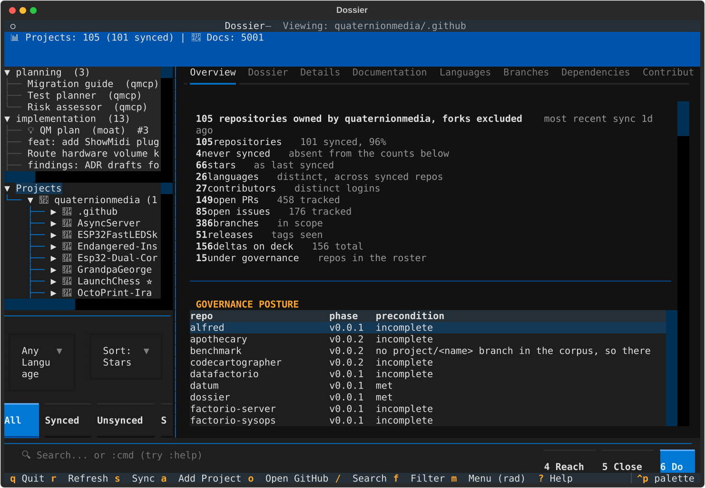

# Dossier Documentation

> **Keep track of what every project is doing, without asking anybody.**
> Dossier reads your repositories directly and shows one view of them: what is in
> flight, who is working where, and where two systems disagree about the same thing.

## Quick Links

| Document | Description |
|----------|-------------|
| [Commands](commands.md) | Every command, numbered by the keys that reach it. Generated |
| [Quickstart](quickstart.md) | Get running in 5 minutes |
| [Dashboard Guide](dashboard.md) | Complete TUI dashboard reference |
| [Governance Dashboard](governance.md) | Where every QM project stands, and what is in flight — which repo to run it in, and the prep it needs |
| [Workflow Cookbook](cookbook.md) | Short, repeatable project and git workflows, with the human step marked. Generated |
| [Disk Cookbook](disk.md) | Recipes for keeping the workstation off the floor — what is eating the disk, and what is safe to reclaim |
| [Settings](settings.md) | Theme selection and app info |
| [Overview](overview.md) | Core concepts and use cases |
| [Workflows](workflows.md) | Copy-paste ready examples |
| [Architecture](architecture.md) | Cache-merge design and data models |
| [Analysis & Consolidation](ANALYSIS_AND_CONSOLIDATION.md) | Scope review, duplicates, and delta tutorial |
| [Extending](extending.md) | Customize for personal/team needs |
| [Contributing](contributing.md) | Development guide |
| [Roadmap](roadmap.md) | Future features and vision |

## What is Dossier?

Dossier is a **decentralized project tracking system** designed for teams working across multiple repositories, organizations, and domains. Think of it as:

- **Jira replacement** — Issues, PRs, releases, versions in one unified view
- **Offline-first** — Local SQLite cache, sync when you have connectivity  
- **Cross-domain** — Track projects across GitHub orgs, teams, even non-Git sources
- **Data-modeled** - Typed schemas, not arbitrary JSON blobs
- **Delta-centric** - Deltas are the unit of change with phases, notes, and links
- **Headless-native** — CLI, TUI, API — no browser tax

Primary goal: standardize the flow of project information. Secondary goal: manage deltas through linking, composition, and human-in-the-loop updates.

## Key Benefits

### 🎯 Replace Proprietary Trackers
Stop paying per-seat for Jira, Linear, or Notion. Dossier is free, open-source, and your data stays local.

### 🔄 Cache-Merge Architecture  
Work offline, sync when connected. No real-time websockets, no polling, no network dependency for reads.

### 📊 Data-Modeled, Not Schema-Free
Typed SQLModel schemas with relationships — query with SQL, not arbitrary JSON paths.

### 🌐 Cross-Domain Tracking
Unified view across multiple GitHub orgs, teams, repos. One dashboard, consistent layouts.

### 📂 Hierarchical Project Browser
Projects auto-organized by org with inline documentation tree. Click docs to preview with prev/next navigation.

### ⌨️ Fixed-Layout TUI
Two-row tabs: main (Dossier, Projects, Deltas) plus project subtabs. Same positions, every project.

## Technology Stack

| Layer | Technology |
|-------|------------|
| Package Manager | [uv](https://github.com/astral-sh/uv) |
| CLI Framework | [Click](https://click.palletsprojects.com/) |
| TUI Dashboard | [Textual](https://textual.textualize.io/) |
| Command Explorer | [Trogon](https://github.com/Textualize/trogon) |
| API Framework | [FastAPI](https://fastapi.tiangolo.com/) |
| ORM | [SQLModel](https://sqlmodel.tiangolo.com/) |
| Local Cache | SQLite |
| HTTP Client | [httpx](https://www.python-httpx.org/) |
| Testing | pytest, respx |

## Getting Started

### 1. Install

```bash
git clone https://github.com/quaternionmedia/dossier.git
cd dossier
uv sync
```

### 2. Set up GitHub Token (recommended)

```bash
export GITHUB_TOKEN=ghp_xxxxxxxxxxxxxxxxxxxx
```

Without a token: 60 requests/hour. With token: 5000 requests/hour.

See [Quickstart - GitHub Authentication](quickstart.md#github-authentication-setup) for detailed setup.

### 3. Sync some projects

```bash
uv run dossier github sync-user your-username
```

### 4. Launch the dashboard

```bash
uv run dossier dashboard
```



That is the Overview tab, which is where the dashboard opens. `m` then a digit
reaches any other view; [the dashboard guide](dashboard.md) has the rest.

## Interfaces

| Interface | Command | Description |
|-----------|---------|-------------|
| Dashboard | `uv run dossier dashboard` | Interactive TUI with project browser |
| Explorer | `uv run dossier tui` | Interactive command explorer |
| CLI | `uv run dossier --help` | Traditional command line |
| API | `uv run dossier serve` | REST API server |

## Project Structure

```
dossier/
├── src/dossier/
│   ├── cli.py           # Click commands
│   ├── api/main.py      # FastAPI application
│   ├── models/schemas.py # SQLModel data models
│   ├── parsers/         # Documentation parsers
│   │   ├── base.py      # Base parser
│   │   └── github.py    # GitHub API client
│   └── tui/app.py       # Textual dashboard
├── tests/               # pytest test suite
├── docs/                # This documentation
└── pyproject.toml       # Project configuration
```

## Development

```bash
# Run tests
uv run pytest

# Run with coverage
uv run pytest --cov

# Start dev server
uv run dossier serve --reload

# Check database status
uv run dossier dev status
```

## License

MIT License - See LICENSE file for details.
